# 基于Springboot+Vue的前后端分离的（家装）公司宣传网站/官网
1. 图片来自于网络，可修改文字图片变成任意官网或宣传网站
3. 不会运行的建议直接加我QQ **2598925230**，提供**收费**的帮助服务。 有其他相关项目需要咨询的，也可以联系我。

## 使用的工具/技术
Java; Springboot; Vue.js; 前后端分离; npm.js; webpack; Mariadb（与MySQL同）; redis

## 运行截图
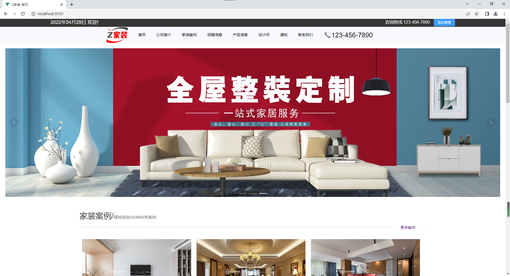
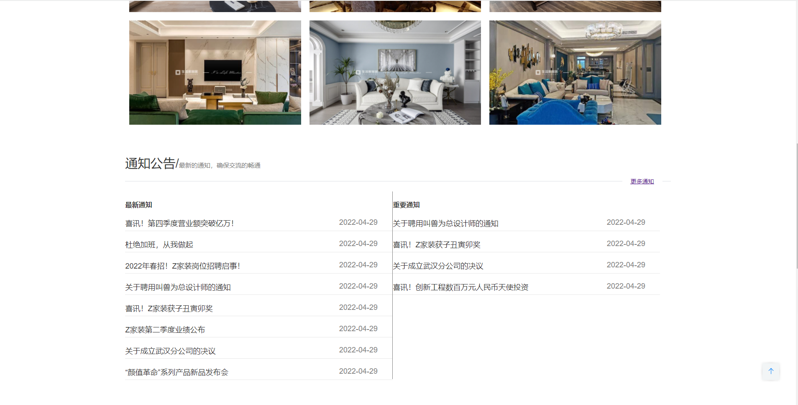

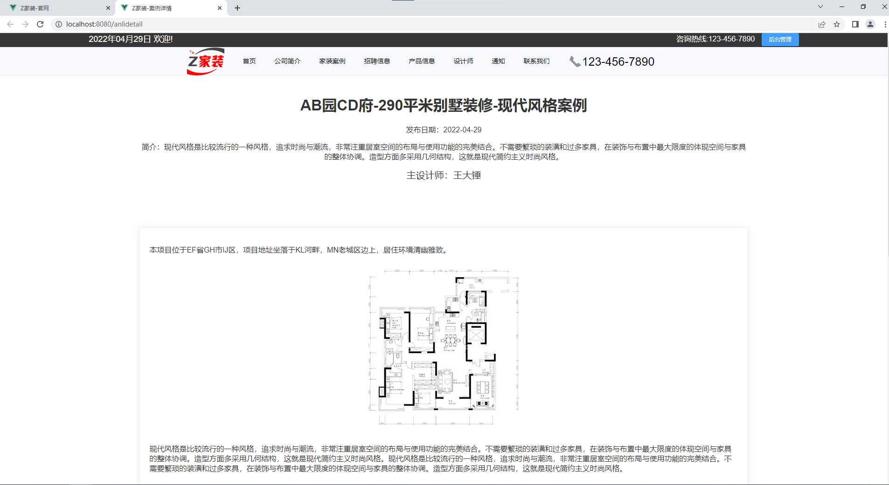
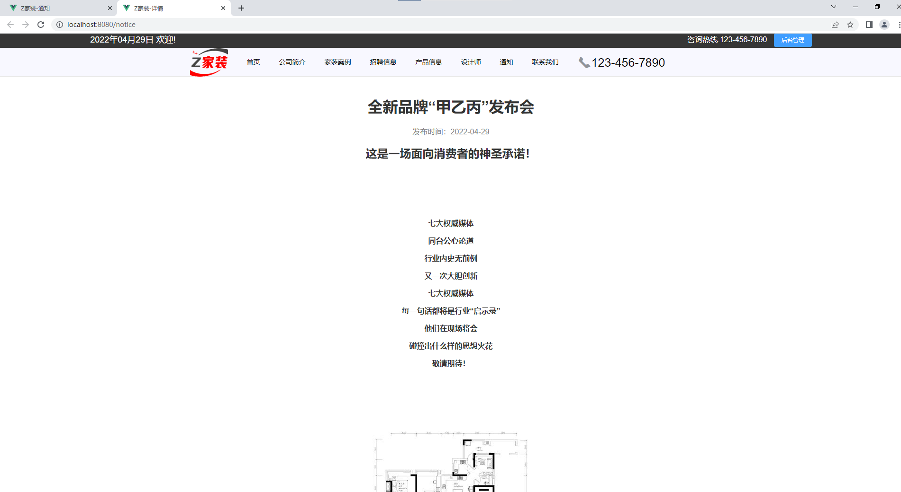
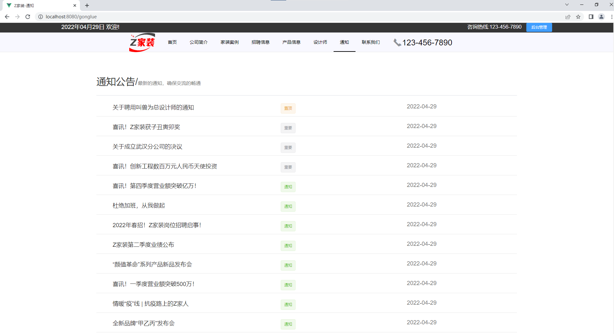
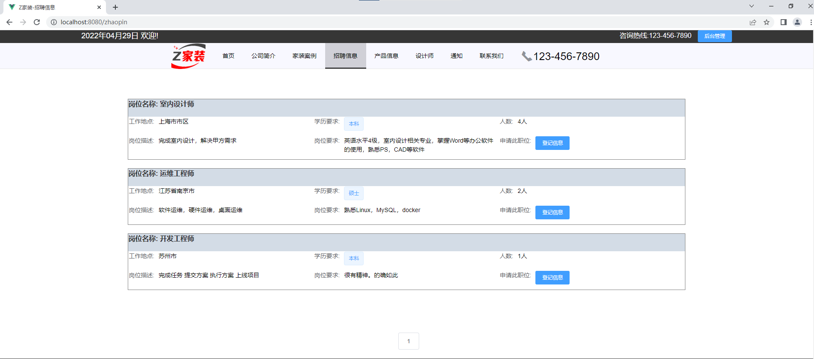
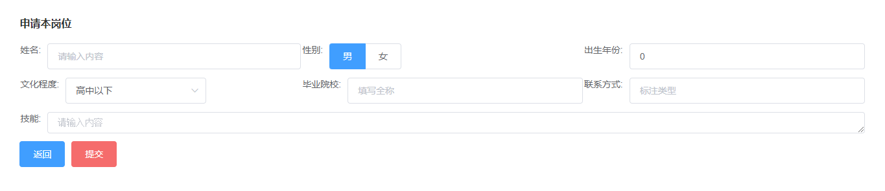
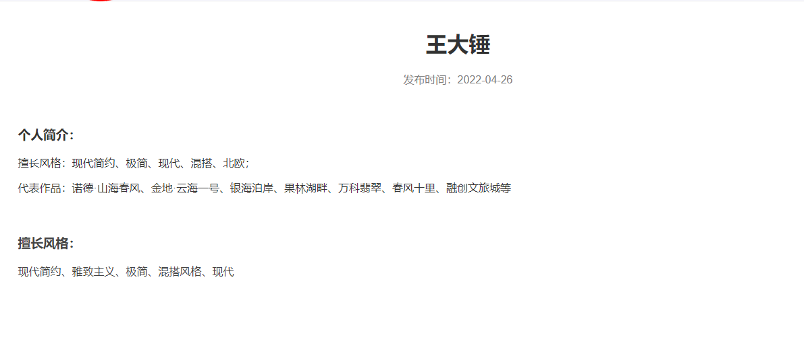
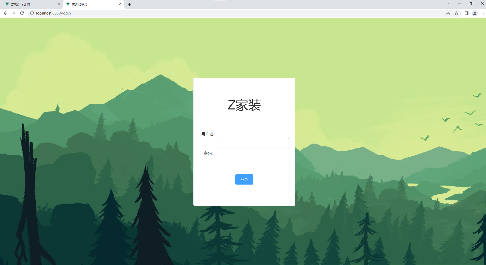
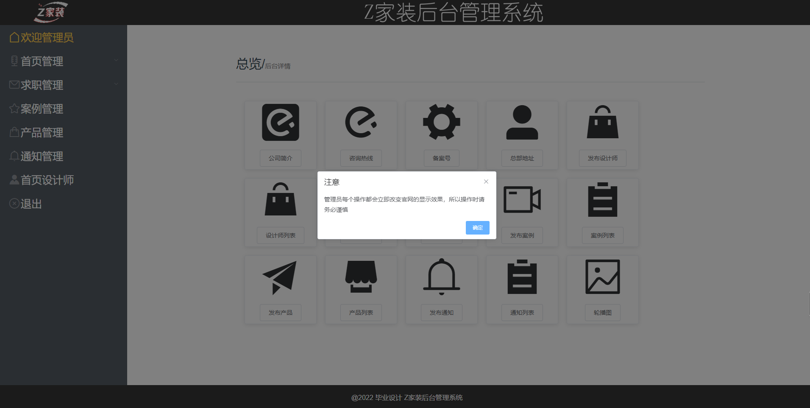
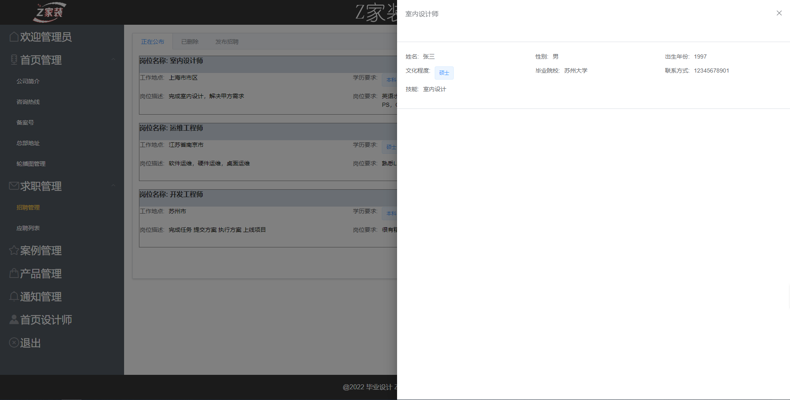
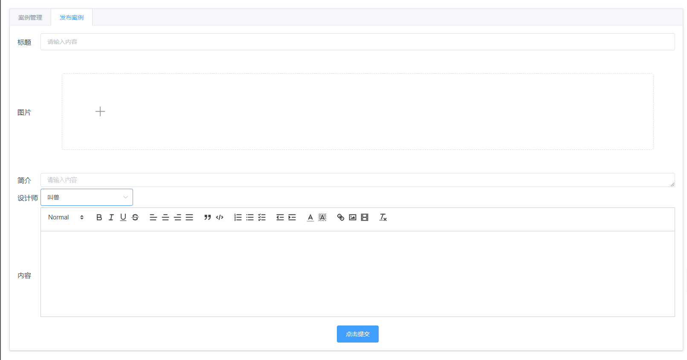
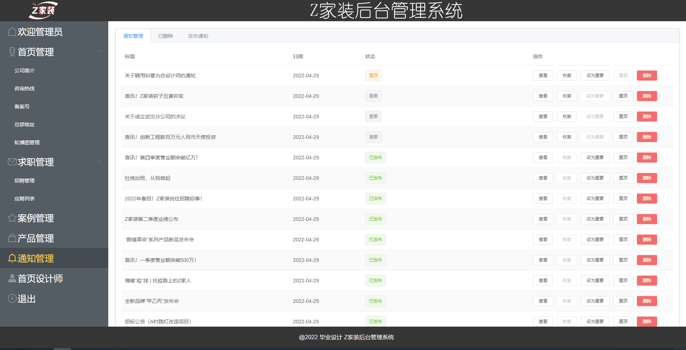

